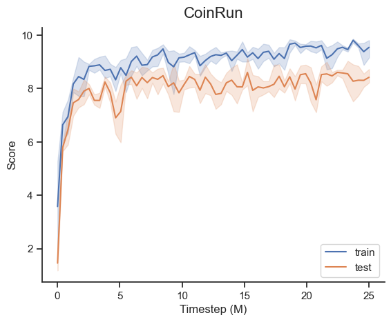
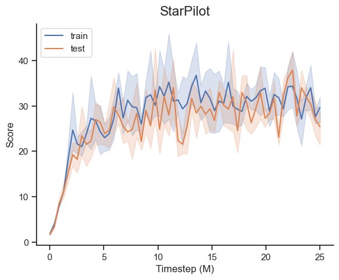
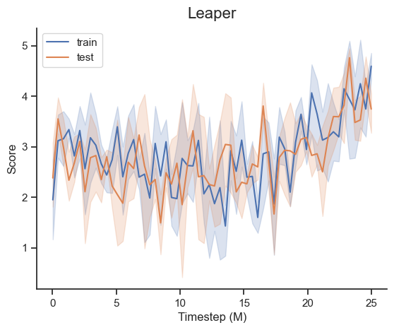
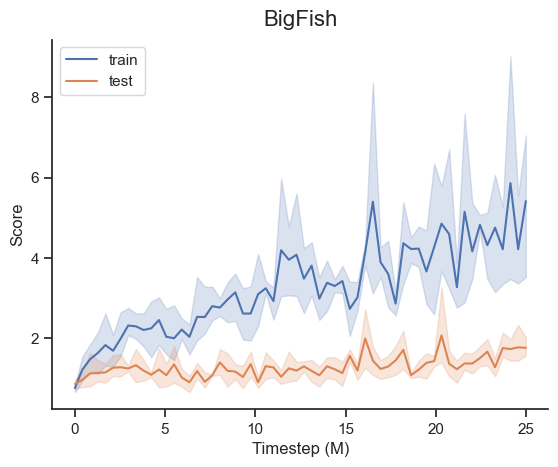
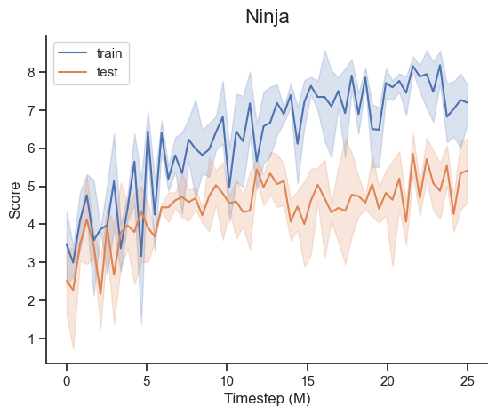
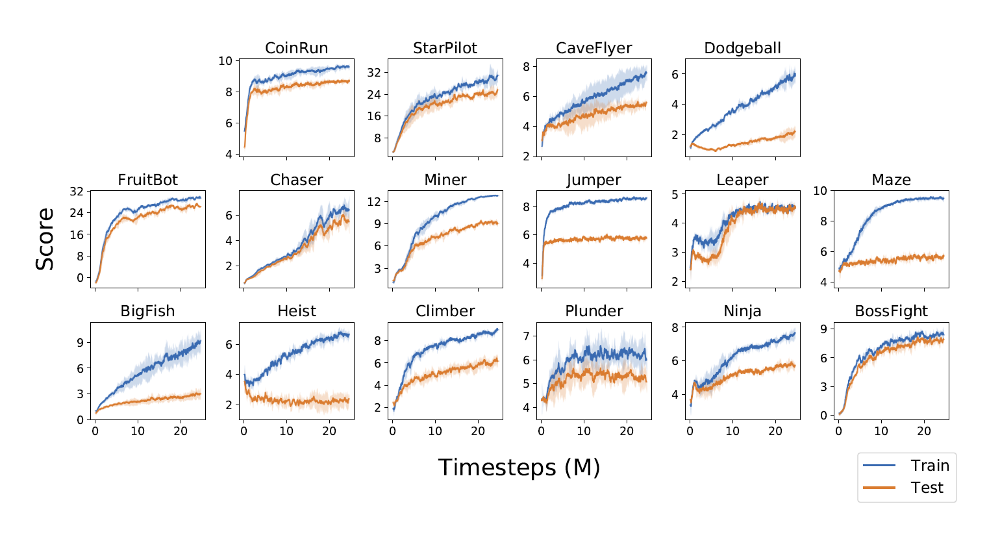

# Proximal Policy Optimization

This repository contains a from-scratch implementation of Proximal Policy Optimization (PPO) using PyTorch. The main objective is to provide a clear and concise implementation of PPO and validate its performance by replicating results from the paper:

> [Leveraging Procedural Generation to Benchmark Reinforcement Learning](https://arxiv.org/abs/1912.01588) by Karl Cobbe, Christopher Hesse, Jacob Hilton, and John Schulman (2020).

As in the paper the agents are trained and benchmarked against the [Procgen Benchmark](https://github.com/openai/procgen) which provides 16 procedurally-generated gym environments.


## What is PPO?
Proximal Policy Optimization is a popular reinforcement learning algorithm. It falls under the category of policy gradient methods, which optimize the policy directly by computing gradients of expected rewards with respect to policy parameters. The algorithm is designed to address some of the limitations of standard policy gradient methods:

- **Stability and Reliability**: Traditional policy gradient methods can be unstable due to large policy updates. PPO improves stability by using a clipped objective function, ensuring that policy updates do not deviate too much from the previous policy.

- **Sample Efficiency**: PPO uses multiple epochs of minibatch updates, making better use of collected data and improving sample efficiency.

- **Simplicity**: Unlike more complex algorithms like Trust Region Policy Optimization (TRPO), PPO is simpler to implement while retaining many of the same benefits. It achieves a good balance between performance and computational complexity.

The algorithm introduces a clipping mechanism to the policy objective, which prevents large policy updates and improves training stability. This is in contrast to traditional policy gradient methods that may take large and potentially harmful updates. The PPO objective function penalizes changes that move the new policy too far away from the old policy, ensuring smoother and more reliable updates. 


## Results

<div align="center">
<table>
<tbody> 
    <tr>
        <td> </td>
        <td></td>
    </tr>
    <tr>
        <td></td>
        <td></td>
    </tr>
    <tr>
        <td></td>
        <td></td>
    </tr>
    <tr>
        <td></td>
        <td></td>
    </tr>
    <tr>
        <td></td>
        <td></td>
    </tr>
</tbody>
</table>
</div>

---

<div align="center">
    
    <p><em>Results from Leveraging Procedural Generation to Benchmark Reinforcement Learning by Karl Cobbe, Christopher Hesse, Jacob Hilton, and John Schulman (2020).</em></p>
</div>


## Installation

1. Clone the repository:

```
git clone https://github.com/hoverslam/rl-proximal-policy-optimization
```

2. Navigate to the directory:

```
cd rl-proximal-policy-optimization
```

3. Set up a virtual environment:

```bash
# Create a virtual environment
python -3.10 -m venv .venv

# Activate the virtual environment
.venv\Scripts\activate
```

4. (Optional) Install PyTorch with CUDA support:

```
pip install torch==2.3.1 --index-url https://download.pytorch.org/whl/cu118
```

5. Install the dependencies:

```
pip install -r requirements.txt
```


## Usage

### Training

```powershell
python -m train --env_name="starpilot"
```

For possible options use ```--help``` :
```powershell
python -m train --help
```

> [!NOTE]  
> Results were obtained with the default settings and `num_evals=60`.

Training, including evaluation, consumed approximately 3 GPU hours on the following system:

* Processor: 13th Gen Intel Core i5-13600KF, 3.50 GHz
* GPU: GeForce RTX 3060
* Memory: 32 GB
* Operating System: Windows 10 Pro, 64-bit

### Play

```powershell
python -m play --env_name="starpilot"
```
> [!WARNING]
> Closing the window will not terminate the script. To stop the script, manually press Ctrl+C.

For possible options use ```--help``` :
```powershell
python -m play --help
```


## File structure

* :file_folder: `img/`: Contains images and GIFs.

* :file_folder: `ppo/`

    * :page_facing_up: `agent.py`: Contains the `PPOAgent` and `ImpalaCNN` classes.

    * :page_facing_up: `trainer.py`: Contains the `PPOTrainer` class.

    * :page_facing_up: `utils.py`: Contains some helper functions and classes.

* :file_folder: `pretrained/`: Directory to store trained models.

* :file_folder: `results/`: Directory to store evaluation results.

* :page_facing_up: `train.py`: Script to train the agent.

* :page_facing_up: `play.py`: Script to let a pretrained agent play a game.

* :orange_book: `results.ipynb`: Interactive notebook for visualizing training results.


## License

The code in this project is licensed under the [MIT License](LICENSE.txt).
